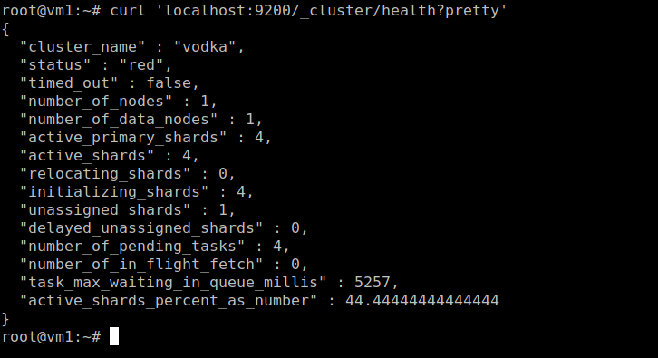
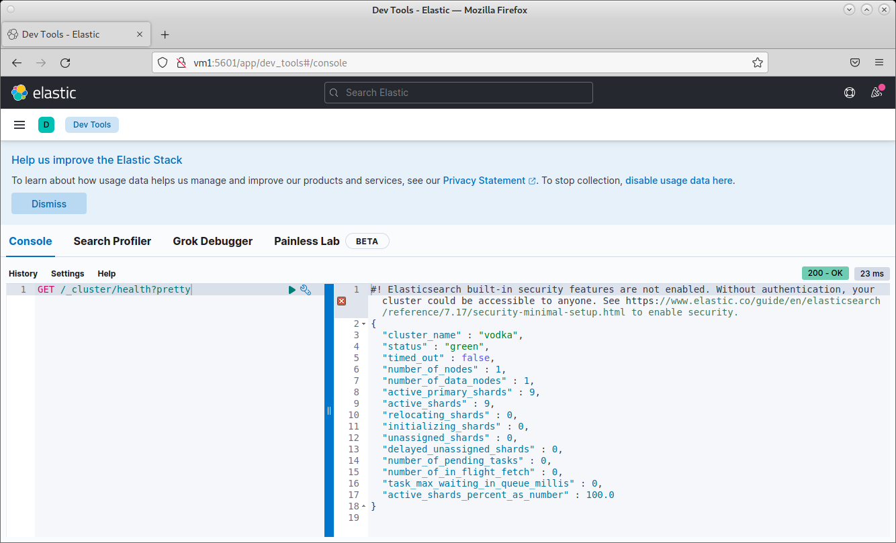
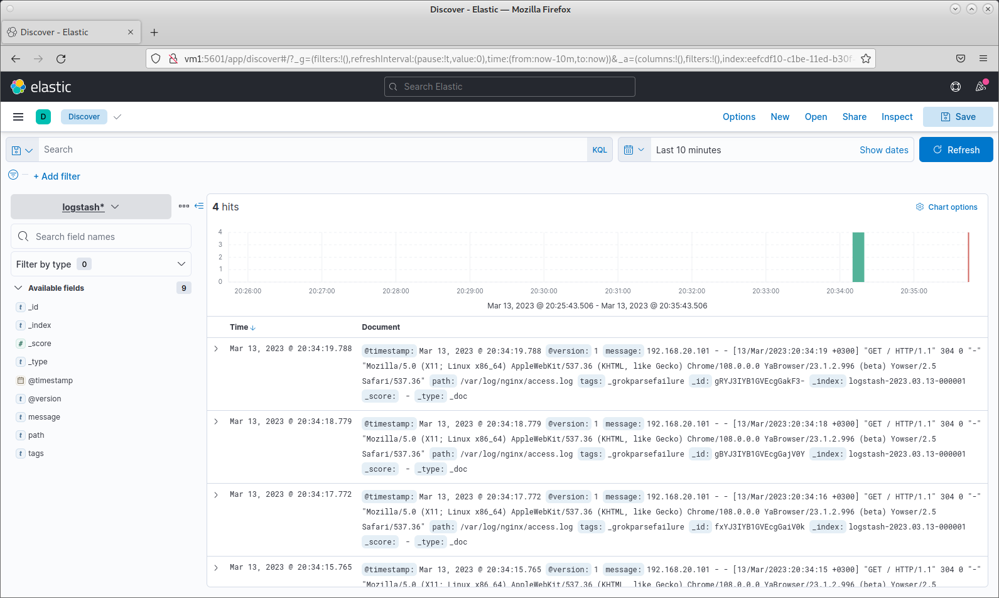
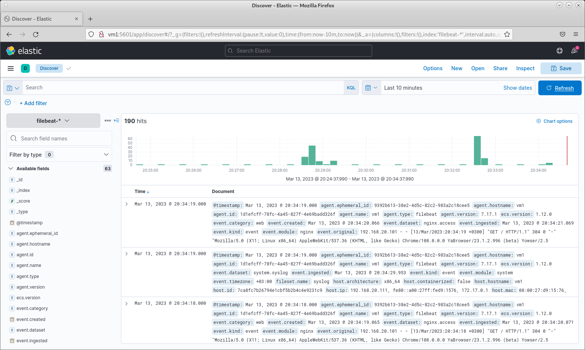

# Домашнее задание к занятию "`ELK`" - `Живарев Игорь`

### Задание 1

`Скриншот команды 'curl -X GET 'localhost:9200/_cluster/health?pretty', сделанной на сервере с установленным Elasticsearch:`

---

### Задание 2

`Скриншот интерфейса Kibana на странице http://<ip вашего сервера>:5601/app/dev_tools#/console, где будет выполнен запрос GET /_cluster/health?pretty:`

---

### Задание 3

`Скриншот интерфейса Kibana, на котором видны логи Nginx, которые были отправлены через Logstash:`

### Задание 4

`Скриншот интерфейса Kibana, на котором видны логи Nginx, которые были отправлены через Filebeat:`

---
